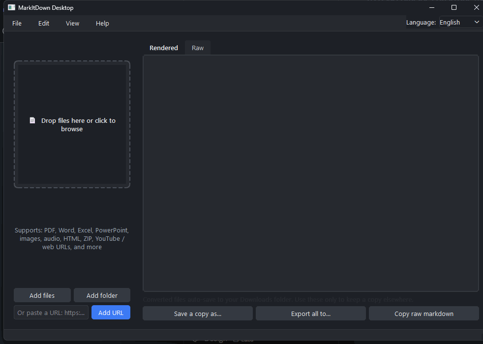

# MarkItDown Desktop (Unofficial)

[](LICENSE)
[](https://github.com/andrest04/markitdown-desktop/releases)
[](#requirements)

A native PySide6 desktop GUI around Microsoft's
[`markitdown`](https://github.com/microsoft/markitdown) Python package.
The core flow is intentionally simple: **drop a file (or paste a URL) and
it converts and saves itself to your Downloads folder automatically** — no
manual "export" step required.

> [!IMPORTANT]
> This app converts files with the privileges of the account running it,
> the same way `markitdown` itself does. Only convert files and URLs you
> trust. See [SECURITY.md](SECURITY.md) for the full policy.

> This is an independent, community-built GUI. It is **not** developed,
> maintained, or endorsed by Microsoft. See [Credits & License](#credits--license)
> below.



**[🌐 Website](https://andrest04.github.io/markitdown-desktop/)** ·
**[⬇️ Download for Windows (.exe)](https://github.com/andrest04/markitdown-desktop/releases/latest/download/markitdown-desktop.exe)** ·
**[Latest release](https://github.com/andrest04/markitdown-desktop/releases/latest)**

## Features

- Drag-and-drop of files/folders (recursive) onto a big, centered drop
  zone, click-to-browse on that same zone, "Add files" / "Add folder"
  buttons, and a URL field (webpage or YouTube link) — any of these starts
  conversion immediately, no separate "Convert" click needed.
- **Auto-save to Downloads**: as soon as an item finishes converting, the
  resulting `.md` file is written straight to `Path.home() / "Downloads"`
  (resolved generically, so it works on any account) using the original
  file's name. If a same-named file already exists there, a numeric suffix
  is appended (`document (1).md`, `document (2).md`, ...) so nothing gets
  overwritten. The queue row shows "Done — Saved to Downloads"; double-click
  a done row to open its containing folder.
- Queue table with per-item status (Pending / Converting / Done / Error),
  multi-select, remove, and clear-all. The drop zone is dominant while the
  queue is empty and shrinks to a slim bar once items are added, so the
  table takes over. A subtle hover glow animation highlights the drop zone.
- Runs on a background `QThreadPool` so the UI never freezes; per-item
  errors are caught and shown without stopping the batch. A progress bar
  only appears while a batch is actively converting, and disappears when
  idle.
- Rendered (HTML via the `markdown` package) and Raw (editable) preview
  tabs. "Save a copy as..." / "Export all to..." buttons remain available
  as an optional way to also save elsewhere — auto-save to Downloads always
  happens regardless.
- Advanced/optional settings (markitdown's `enable_plugins`,
  `keep_data_uris`, Azure Document Intelligence `docintel_endpoint`, Azure
  Content Understanding `cu_endpoint`/`cu_analyzer_id`, and per-item
  extension/mimetype/charset `StreamInfo` hints) live in a secondary
  **Edit > Advanced Settings...** dialog, out of the way of the main
  drop-and-done flow.
- Light/dark QSS themes, with "follow system" or manual toggle, persisted
  via `QSettings` (window geometry, last export folder, theme choice).
- **English/Spanish (neutral) UI** via a lightweight, dependency-free
  translation layer (`app/i18n.py` — no Qt Linguist `.ts`/`.qm` build step).
  Defaults to your system locale (Spanish for `es_*`, English otherwise)
  and can be switched anytime with the language dropdown next to the menu
  bar; the choice is remembered via `QSettings` and switching updates the
  whole UI, including already-queued rows, immediately — no restart needed.

## Supported input formats

Anything `markitdown` supports: PDF, Word, Excel, PowerPoint, images (EXIF
+ optional OCR), audio (transcription), HTML, CSV, JSON, XML, ZIP
archives, EPub, plain text, and YouTube / general web URLs. See the
[markitdown README](https://github.com/microsoft/markitdown) for the full,
up-to-date list.

## Download a pre-built binary (no Python required)

- **Windows**: [download `markitdown-desktop.exe`](https://github.com/andrest04/markitdown-desktop/releases/latest/download/markitdown-desktop.exe)
  directly — a single file, no install, no unzip. Just run it.
- **macOS/Linux**: each [release](https://github.com/andrest04/markitdown-desktop/releases/latest)
  includes a ready-to-run zip — download the one for your OS, unzip, and
  run `markitdown-desktop`.

A zipped Windows build (`markitdown-desktop-windows.zip`) is also available
on the [releases page](https://github.com/andrest04/markitdown-desktop/releases/latest)
if you prefer that format.

## Requirements (running from source)

- Windows 10/11, macOS, or Linux
- [Python 3.10+](https://www.python.org/downloads/) (on Windows, check "Add
  python.exe to PATH" during install)
- For audio transcription only: [ffmpeg](https://ffmpeg.org/download.html)
  on PATH

## Installing from source

```bash
git clone https://github.com/andrest04/markitdown-desktop.git
cd markitdown-desktop
python -m pip install -r requirements.txt
```

On macOS/Linux, use `python3` instead of `python` if that's how your
system exposes it.

## Running

- **Windows**: double-click `run.bat`, or run `python main.py`.
- **macOS/Linux**: run `./run.sh`, or `python3 main.py`.

The "open containing folder" action (double-click a finished row) uses
`explorer` on Windows, `open -R` on macOS, and `xdg-open` on Linux.

## Project structure

```
main.py                    entry point
app/ui/main_window.py      main window, drop zone, advanced settings dialog
app/ui/theme.py            light/dark QSS stylesheets
app/core/converter.py      MarkItDown wrapper, background worker, auto-save logic
app/core/queue_model.py    queue table data model
app/i18n.py                English/Spanish translation layer
```

## Contributing

Contributions and suggestions are welcome. See [CONTRIBUTING.md](CONTRIBUTING.md)
for how to get set up and the project's conventions. This project follows
the [Code of Conduct](CODE_OF_CONDUCT.md).

|            | Link                                                              |
| ---------- | ------------------------------------------------------------------ |
| **Issues** | [Open an issue](https://github.com/andrest04/markitdown-desktop/issues) |
| **PRs**    | [Open pull requests](https://github.com/andrest04/markitdown-desktop/pulls) |
| **Security** | See [SECURITY.md](SECURITY.md) for how to report vulnerabilities privately |

## Credits & License

This project wraps [`markitdown`](https://github.com/microsoft/markitdown)
by Microsoft, licensed under the [MIT License](https://github.com/microsoft/markitdown/blob/main/LICENSE).
All actual file-conversion logic is theirs — this repository only adds a
desktop GUI on top of their public Python API. All credit for `markitdown`
itself goes to Microsoft and its contributors.

This GUI's own code is licensed under the [MIT License](LICENSE) as well.
"MarkItDown" is a name used by Microsoft's project; this repository is an
unofficial, unaffiliated GUI and claims no association with or endorsement
by Microsoft.
